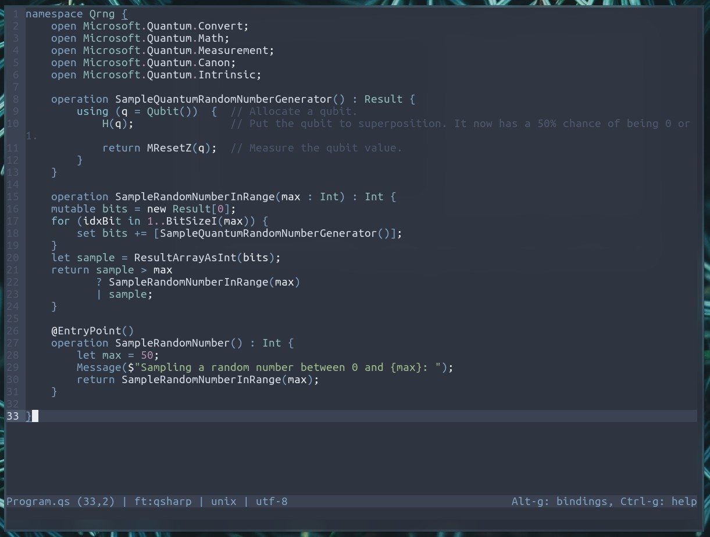
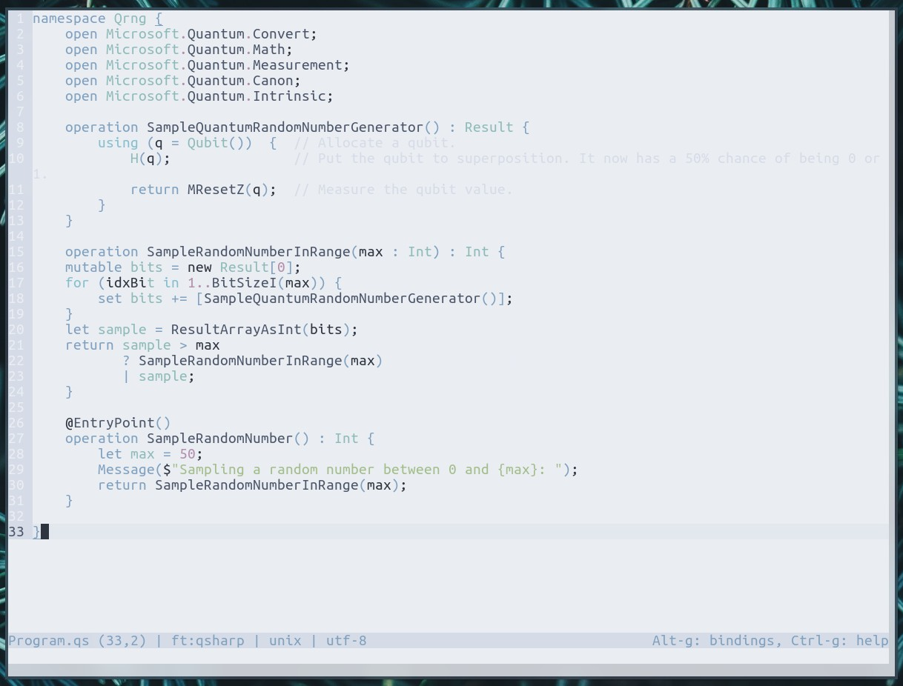
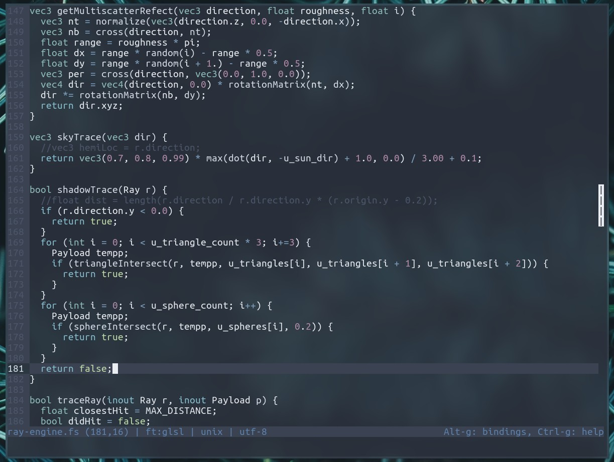
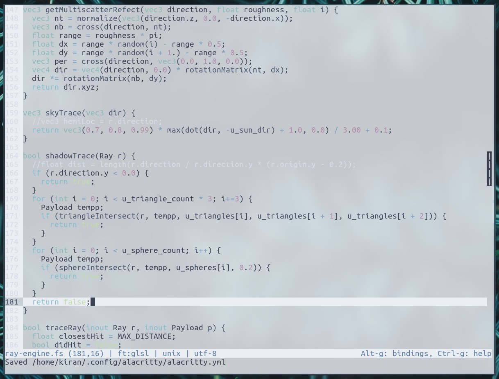

# Micro Nord Colors

A [Nord](https://www.nordtheme.com/) colorscheme port for the [Micro](https://micro-editor.github.io/index.html) editor.

## Features

Two new color scemes, supporting both true-color and 16-color versions. The 16-color versions require that the terminal has the Nord colorscheme installed, and support transparency (if the terminal and compositor are configured for it).

## Screenshots

Truecolor:

16-Color (with transparency):

