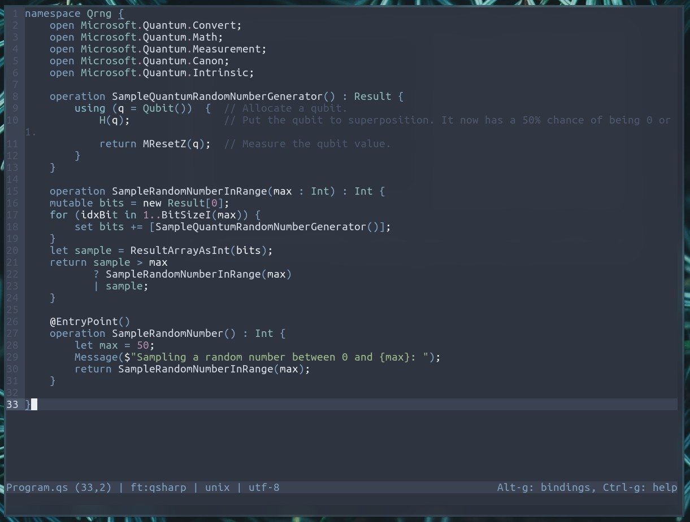
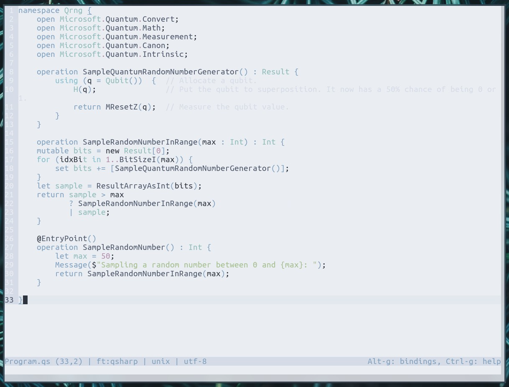
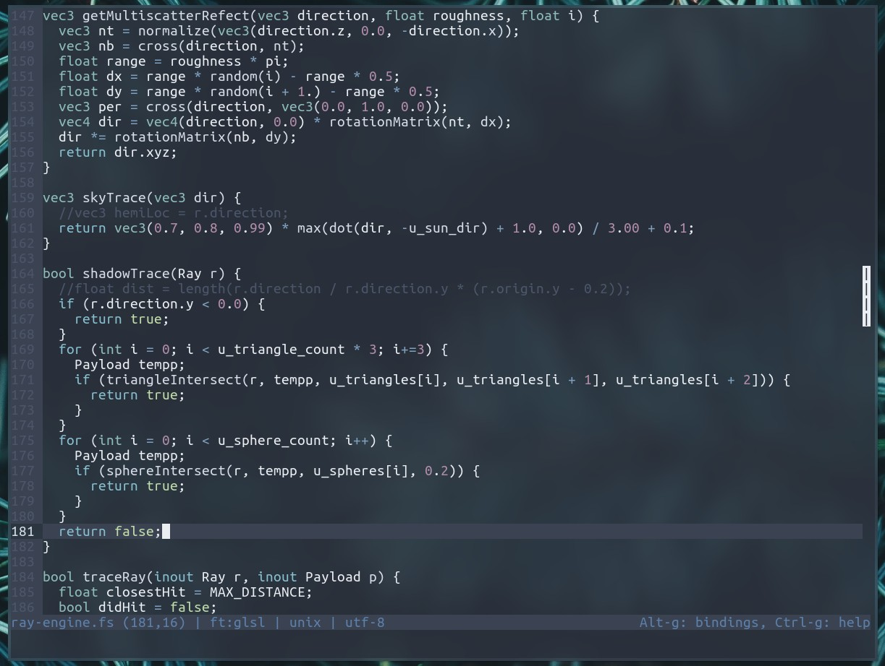
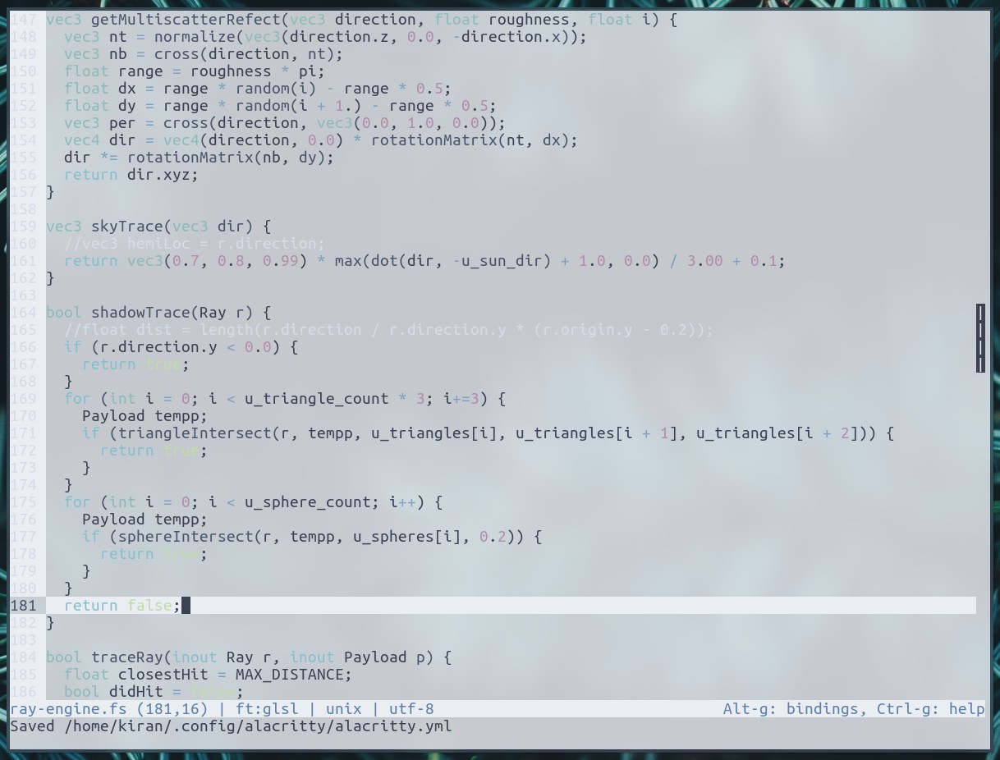

# Micro Nord Colors

A [Nord](https://www.nordtheme.com/) colorscheme port for the [Micro](https://micro-editor.github.io/index.html) editor.

## Installation

To install the colorscheme, first run the following command in terminal:

```
micro --plugin install nordcolors
```

Then, open micro and press Ctrl+E. Then type in:

```
set colorscheme <name>
```

Where `<name>` can be `nord-tc`, `nord-tc-light`, `nord-16` or `nord-16-light`.

See the [help file](help/nordcolors.md) for troubleshooting issues such as off colors or no transparency.

## Features

Two new color schemes, supporting both true-color and 16-color versions. The 16-color versions require that the terminal has the Nord colorscheme installed, and support transparency (if the terminal and compositor are configured for it).

## Screenshots

Truecolor:





16-Color (with transparency):




